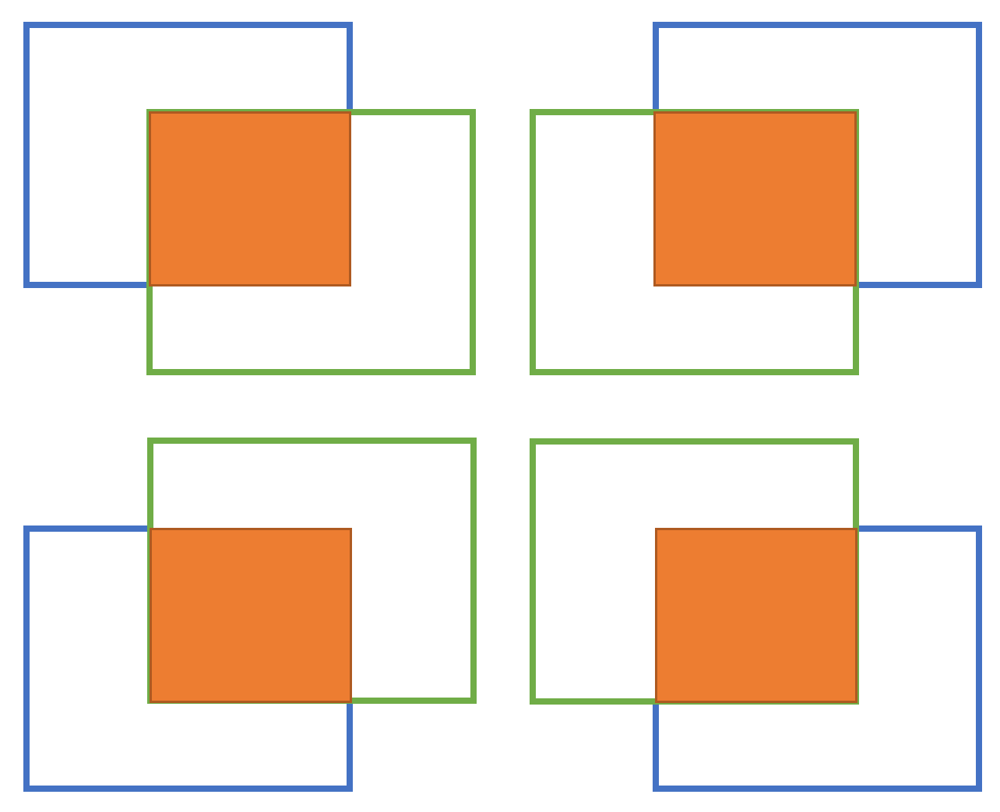
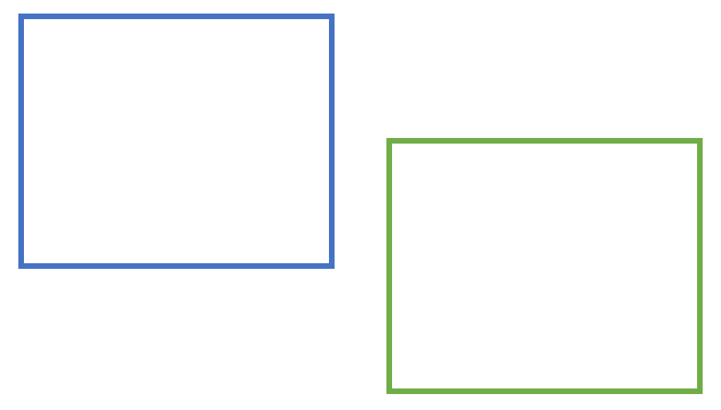
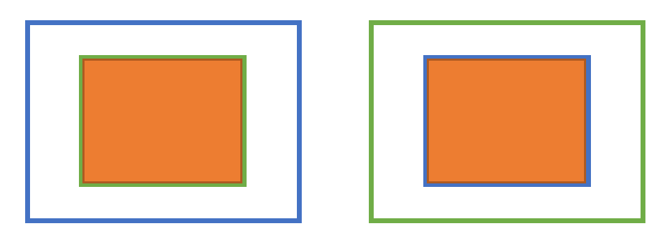

最近面试被问到这样一个问题：IOU是怎么计算的？

这个问题我当然知道：IOU就是交并比，intersection over union，直接用两个矩形的交集区域面积除以并集区域的面积就行了。

再问：具体用代码怎么实现呢？

我回想之前似乎看过IOU计算的代码，好像也没几行，觉得简单也就没认真看。现在仔细一想，两个矩形之间的位置关系可以分为3种，那么IOU的计算似乎也应该分为下面几种情况来讨论：

**两矩形相交，又可分为四种相对位置：**



**两矩形相离：**



**包含关系：**



那岂不是要分7种情况来讨论！？

实际上无需如此麻烦，所有情况都可以用一种方式来处理：

```python
def calIOU(boxA, boxB): # 矩形由左上、右下两个顶点来确定
    boxA = [int(x) for x in boxA] # to int
    boxB = [int(x) for x in boxB]
	
    # 找到相交区域，相交区域左上点为A，右下点为B
    xA = max(boxA[0], boxB[0])
    yA = max(boxA[1], boxB[1]) # A点是两矩形左上顶点中，靠近右下的那个
    xB = min(boxA[2], boxB[2])
    yB = min(boxA[3], boxB[3]) # B点是两矩形右下顶点中，靠近左上的那个

    # 计算交集的面积，假如A不严格位于B的左上方，说明两个矩形没有交集，交集面积为0
    interArea = max(0, xB - xA + 1) * max(0, yB - yA + 1)

    #计算两矩形的面积
    boxAArea = (boxA[2] - boxA[0] + 1) * (boxA[3] - boxA[1] + 1)
    boxBArea = (boxB[2] - boxB[0] + 1) * (boxB[3] - boxB[1] + 1)
    
    # 并集面积 = 两矩形面积之和 - 交集面积， IOU = 交集面积 / 并集面积
    iou = interArea / float(boxAArea + boxBArea - interArea)

    return iou
```

确实不难，下次继续努力吧。(ง •_•)ง
